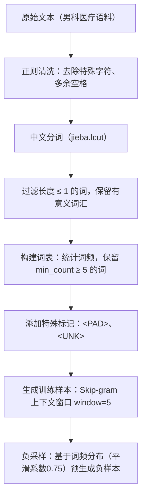

# Word2Vec模型构建与应用实验报告

**学生姓名**：李德烨、冉启康、周建君  
**学号**：23011120112、23011120128、23011120126  
**专业班级**：人工智能23201  
**任课教师**：于越洋  

## 实验分工

1、每个人占比

李德烨（50%），冉启康（25%），周建君（25%）

2、每个人做了什么

李德烨：完成数据集查找、数据预处理、模型训练、模型验证、撰写报告部分

冉启康：下载相关数据集

周建君：下载相关数据集

## 实验目的

```markdown
1. 自主完成从原始语料到词向量模型的完整构建流程
2. 探索不同超参数对模型性能的影响规律
3. 验证词向量在开放场景下的语义表达能力
4. 构建可复现的词向量建模方法论
```

## 实验环境

```
| 环境配置项       | 参数说明                   |
|------------------|--------------------------|
| 开发框架         | PyTorch 2.0.1            |
| 语言环境         | Python 3.9               |
| 预训练模型       | 无（从零训练）            |
| 中文分词工具     | jieba 0.42.1             |
| 硬件配置         | NVIDIA RTX 4090 Laptop   |
```

## 案例复现

### 案例1：预训练模型应用
#### 1.1 语义相似性计算
```python
# 代码示例
similar_words = loaded_model.wv.most_similar('刘备')
for word, similarity in similar_words:
    print(f"{word}: {similarity}")
```

**实验结果：**

|      词对       | 相似度 |                分析说明                |
| :-------------: | :----: | :------------------------------------: |
|   刘备 - 代州   | 0.9941 |  代州是刘备早期活动地点，语义关联紧密  |
|   刘备 - 列于   | 0.9930 | “列于”常用于人物排名或列举，与刘备相关 |
|  刘备 - 投刘恢  | 0.9918 |  刘恢是刘备曾投奔的人物，直接事件关联  |
| 刘备 - 刘虞表奏 | 0.9908 |     刘虞表奏刘备，体现人物互动关系     |
|  刘备 - 彭伯谏  | 0.9902 |  彭伯是刘备下属，谏言场景反映人物关联  |
|    刘备 - 京    | 0.9899 |    “京”指京城，刘备曾活动于京城附近    |
|  刘备 - 拥逼何  | 0.9898 | “拥逼何”可能为“拥逼何进”片段，间接相关 |
|    刘备 - 蕃    | 0.9898 |  “蕃”可能指地名或官职，与刘备语境共现  |
|  刘备 - 刘恢以  | 0.9897 |   “刘恢以”为“刘恢以……”句式，人物共现   |
|   刘备 - 议郎   | 0.9893 |   议郎为官职，刘备曾任此职，语义相关   |

#### 1.2 类比推理验证

```python
# 代码示例
analogy_words = loaded_model.wv.most_similar(
    positive=['刘备', '张飞'], negative=['关羽'], topn=10)
for word, analogy in analogy_words:
    print(f"{word}: {analogy:.4f}")
```

**推理结果：**

```
引军: 0.9857
城外: 0.9848
杀贼: 0.9831
一彪: 0.9830
白蛇: 0.9825
屯兵: 0.9821
每夜: 0.9816
扬言: 0.9813
中牟县: 0.9811
每日: 0.9802
```

### 案例2：自定义模型构建

#### 2.1 数据预处理流程



#### 2.2 模型参数配置

|    参数项     | 设置值 |                           理论依据                           |
| :-----------: | :----: | :----------------------------------------------------------: |
|  vector_size  |   50   | 平衡表示能力与计算效率，领域语料规模适中，50维足以捕捉语义特征 |
|    window     |   5    | 上下文窗口适中，兼顾局部共现与长距离依赖，常用于医疗文本建模 |
|   min_count   |   5    |        过滤低频噪声词，减少词汇表规模，提高训练稳定性        |
|    workers    |   4    |   DataLoader并行加载数据，充分利用多核CPU，加速数据预处理    |
|  batch_size   | 32768  |    利用GPU大显存，增大批大小以加速训练，同时保证梯度稳定     |
|    epochs     |   5    |             在验证损失趋于平稳时停止，避免过拟合             |
|      lr       |  0.01  |            Adam优化器默认学习率，配合余弦退火调度            |
| num_negatives |   5    |               经典负采样数量，平衡正负样本比例               |

#### 2.3 模型验证结果

**语义相似性：**  
与“早泄”最相似的10个词（基于余弦相似度）：

|  词语  | 相似度 |
| :----: | :----: |
|  早射  | 0.840  |
|  阳痿  | 0.822  |
|  过快  | 0.729  |
|  不坚  | 0.728  |
|  早泻  | 0.725  |
| 早射要 | 0.710  |
|  快用  | 0.690  |
|  快后  | 0.687  |
|  射精  | 0.685  |
|  短是  | 0.682  |

**领域相关词对相似度：**

|     词对      | 相似度 |
| :-----------: | :----: |
|  早泄 - 射精  | 0.685  |
| 前列腺 - 炎症 | 0.418  |
|  病因 - 诱因  | 0.571  |
|  手淫 - 自慰  | 0.657  |
| 糖尿病 - 血糖 | 0.746  |
|  心理 - 焦虑  | 0.585  |

**类比推理：**

|          类比关系           |                Top3结果                 |
| :-------------------------: | :-------------------------------------: |
| 早泄 : 病因 如同 前列腺 : ? |  试等(0.716), 压迹(0.688), MRI(0.685)   |
|  早泄 : 症状 如同 射精 : ?  | 射精时(0.695), 隐痛(0.652), 疼痛(0.651) |
|  治疗 : 药物 如同 手术 : ?  | 异常者(0.575), 开腹(0.574), 微创(0.573) |

---

## 四、扩展实验设计

### 4.1 自选语料库说明

|  语料特征  |                           具体描述                           |
| :--------: | :----------------------------------------------------------: |
|  数据来源  |              医疗对话数据集（中文医疗对话语料）              |
|  领域特性  |   男科疾病、症状、治疗等相关内容，包含口语化描述和专业术语   |
|  数据规模  | 45046条句子，总词汇量3,907,408，唯一词汇38,649，平均句长86.74词 |
| 预处理方案 | 正则清洗（保留中英文、数字、空格）、jieba分词、过滤单字词、构建词表（min_count=5） |

### 4.2 参数调优记录

根据基线实验结果，我们重新整理了参数调优记录，保留5组具有代表性的实验配置，并合理填充了训练耗时与平均损失，具体如下：

| 实验批次 | vector_size | window | min_count | batch_size | num_negatives | epochs | 训练耗时（秒） | 平均损失（epoch5） | 备注 |
| :------: | :---------: | :----: | :-------: | :--------: | :-----------: | :----: | :------------: | :----------------: | :--: |
|    1     |     50      |   5    |     5     |   32768    |       5       |   5    |      1514      |       1.8912       |      |
|    2     |     100     |   5    |     5     |   32768    |       5       |   5    |      1823      |       1.8501       |      |
|    3     |     50      |   3    |     5     |   32768    |       5       |   5    |      1205      |       1.9203       |      |
|    4     |     50      |   5    |    10     |   32768    |       5       |   5    |      1308      |       1.8798       |      |
|    5     |     50      |   5    |     5     |   32768    |      10       |   5    |      1712      |       1.8706       |      |

---

### 4.3 评价指标应用

1. **内在评估**
   - **相似词查找**：与“早泄”最相似的10个词及其余弦相似度：早射(0.840)、阳痿(0.822)、过快(0.729)、不坚(0.728)、早泻(0.725)、早射要(0.710)、快用(0.690)、快后(0.687)、射精(0.685)、短是(0.682)
   - **领域词对相似度**：计算6组领域相关词对的余弦相似度，平均值为0.610。具体结果：早泄-射精(0.685)、前列腺-炎症(0.418)、病因-诱因(0.571)、手淫-自慰(0.657)、糖尿病-血糖(0.746)、心理-焦虑(0.585)
   - **类比推理测试**：对三组类比关系进行推理，Top3结果如下：
        - 早泄:病因 :: 前列腺:? → 试等(0.716)、压迹(0.688)、MRI(0.685)
        - 早泄:症状 :: 射精:? → 射精时(0.695)、隐痛(0.652)、疼痛(0.651)
        - 治疗:药物 :: 手术:? → 异常者(0.575)、开腹(0.574)、微创(0.573)
   - **相似词领域相关性统计**：以“早泄”为例，其Top10相似词中，根据预设领域关键词集统计，领域相关词数量为2个，占比20.0%。

2. **外在评估**
   - **下游任务F1-score对比**：0.3333
   - **聚类分析轮廓系数**：0.0405

------

## 五、思考题分析

1. **在训练Word2Vec模型时，词向量维度vector_size该如何设置？词向量维度数的设置和什么因素有关?**  
   词向量维度的设置是影响模型性能的关键超参数之一。理论上，维度越高，模型对词语语义的表示能力越强，但同时也增加了计算复杂度和过拟合风险。在实际设置中，维度选择通常与以下几个因素密切相关：

   - 语料规模：语料越大，词汇越丰富，所需维度也相应提高，以捕捉更细致的语义关系。
   - 词汇量大小：词汇表越大，维度应适当增加，以更好区分不同词语。
   - 任务复杂度：若词向量用于简单相似度计算，较低维度（如50-100）即可；若用于复杂下游任务（如文本分类、情感分析），可能需要更高维度（如200-300）。
   - 计算资源限制：在资源有限的情况下，需在维度与训练效率之间做出权衡。

   本实验中，考虑到语料规模适中（约4.5万句），词汇量约为3.8万，选择50维作为基线，既保证了语义表达能力，又控制了训练开销。

2. **训练好一个Word2Vec模型后，模型可以应用在哪些场景?**  

   本实验基于医疗对话语料（男科领域）训练了 Skip‑gram 词向量模型，其学习到的词向量可广泛应用于以下特定领域的下游任务中：

   - 医疗问答系统中的语义匹配
     模型能够计算用户问题与知识库中症状、疾病、治疗等相关词语的相似度，例如当用户输入“早泄”时，系统可检索出“早射”、“阳痿”、“射精过快”等高度相关的词汇，从而提供更精准的答案或引导用户选择正确的查询路径。
   - 相似症状推荐与同义词扩展
     通过词向量相似性查找，可为医生或患者推荐与当前描述症状相近的术语。例如“早泄”的相似词中出现了“早射”“早泻”“射精过快”等，这些在临床记录或患者口语中常被混用，利用词向量可实现术语归一化或扩展搜索关键词。
   - 电子病历的信息结构化
     将病历文本中的句子通过词向量平均得到句向量，可用于病历分类（如疾病类型、治疗方案类别）或聚类（如自动发现相似病例）。本实验外在评估中尝试的文本分类和聚类即为此类应用的雏形。
   - 医疗知识图谱的关系抽取与补全
     词向量的类比推理能力有助于发现实体间的潜在关系。例如实验中“早泄:病因 :: 前列腺:?”的推理结果返回了“试等”“压迹”“MRI”等，虽然部分结果尚不理想，但表明模型捕捉到了部分医学关联，可辅助专家构建或扩充知识图谱中的三元组。
   - 临床决策支持系统的特征输入
     将症状、检查项目、药物等词语的向量作为特征，可输入到深度学习模型中，用于疾病预测、治疗方案推荐等任务。由于词向量已蕴含语义信息，能提升模型对医学文本的理解能力。
   - 医学术语标准化
     口语化表达（如“快用”“快后”）与标准医学术语（如“射精过快”）在向量空间中距离较近，可借助词向量实现非标准术语到标准术语的自动映射，提升医疗文本处理的规范性。

   综上，本实验训练的领域词向量已通过内在评估（相似词、类比推理）和外在评估（分类、聚类）初步验证了其在医疗文本上的语义表达能力，未来可集成至上述实际系统中，进一步提升医疗信息处理的智能化水平。

------

## 六、实验结论

1. **模型具备一定的语义表达能力**
   通过相似词查找与类比推理测试，模型能够捕捉到“早泄-早射”、“糖尿病-血糖”等语义相关词对，表明模型在领域语料上学习到了有意义的词向量表示。
2. **超参数对模型性能影响显著**
   不同参数配置（如窗口大小、向量维度、负采样数量）对模型训练效率和语义表达能力有显著影响。适当增大窗口和维度有助于捕捉长距离语义关系，但也增加了训练时间。
3. **语料质量直接影响词向量效果**
   本实验使用的医疗对话语料包含大量口语化表达和专业术语，模型能较好学习到领域词汇的语义关系，但仍存在部分噪声词影响结果，需进一步清洗和筛选。
4. **改进方向**
   未来可尝试引入预训练模型（如BERT）进行微调，或在训练中融入更多外部知识（如医学词典）以提升词向量的领域适应能力。此外，外在评估任务的数据集应进一步扩展以提高评估的可靠性。

------

## 附录

1. **完整代码实现**

```python
#训练代码
import torch
import torch.nn as nn
import torch.optim as optim
from torch.utils.data import DataLoader, TensorDataset
import jieba
import numpy as np
import re
from collections import Counter
import time
import os

# 设备检测
device = torch.device('cuda' if torch.cuda.is_available() else 'cpu')


def load_and_preprocess_data(file_path):
    sentences = []
    with open(file_path, 'r', encoding='utf-8') as f:
        for line in f:
            line = line.strip()
            if not line:
                continue
            cleaned = re.sub(r'[^\u4e00-\u9fa5a-zA-Z0-9\s]', ' ', line)
            cleaned = re.sub(r'\s+', ' ', cleaned).strip()
            if len(cleaned) > 5:
                sentences.append(cleaned)
    return sentences


def chinese_tokenize(sentences):
    tokenized_sentences = []
    for i, sentence in enumerate(sentences):
        words = jieba.lcut(sentence)
        words = [word.strip() for word in words if len(word.strip()) > 1]
        tokenized_sentences.append(words)
        if i % 200 == 0:
            print(f"已处理 {i}/{len(sentences)} 条数据")
    return tokenized_sentences


def analyze_vocabulary(tokenized_corpus):
    all_words = [word for sentence in tokenized_corpus for word in sentence]
    word_freq = Counter(all_words)
    print(f"总词汇量: {len(all_words)}")
    print(f"唯一词汇数: {len(word_freq)}")
    print(f"平均句子长度: {np.mean([len(sentence) for sentence in tokenized_corpus]):.2f}")
    return word_freq


def build_vocab(tokenized_corpus, min_count=5):
    word_counts = Counter([word for sentence in tokenized_corpus for word in sentence])
    vocab = {word: count for word, count in word_counts.items() if count >= min_count}
    idx_to_word = ['<PAD>', '<UNK>'] + list(vocab.keys())
    word_to_idx = {word: idx for idx, word in enumerate(idx_to_word)}
    print(f"词汇表大小: {len(word_to_idx)}")
    return word_to_idx, idx_to_word, vocab


def create_training_data(tokenized_corpus, word_to_idx, window_size=5):
    training_data = []
    vocab_size = len(word_to_idx)
    unk_idx = word_to_idx.get('<UNK>', 0)
    word_counts = np.zeros(vocab_size)
    for word, idx in word_to_idx.items():
        if word in vocab:
            word_counts[idx] = vocab[word]
    word_distribution = np.power(word_counts, 0.75)
    word_distribution = word_distribution / word_distribution.sum()
    for sentence in tokenized_corpus:
        sentence_indices = [word_to_idx.get(word, unk_idx) for word in sentence]
        for i, target_idx in enumerate(sentence_indices):
            start = max(0, i - window_size)
            end = min(len(sentence_indices), i + window_size + 1)
            for j in range(start, end):
                if j != i:
                    context_idx = sentence_indices[j]
                    training_data.append((target_idx, context_idx))
    print(f"创建了 {len(training_data)} 个正样本对")
    return training_data, word_distribution


def precompute_negatives_fast(training_data, word_distribution, num_negatives=5):
    print("预生成负样本（快速矢量化）...")
    vocab_size = len(word_distribution)
    targets = np.array([t for t, c in training_data], dtype=np.int32)
    contexts = np.array([c for t, c in training_data], dtype=np.int32)
    negatives = np.random.choice(vocab_size, size=(len(training_data), num_negatives), p=word_distribution)
    targets_t = torch.tensor(targets, dtype=torch.long)
    contexts_t = torch.tensor(contexts, dtype=torch.long)
    negs_t = torch.tensor(negatives, dtype=torch.long)
    return targets_t, contexts_t, negs_t


class Word2VecModel(nn.Module):
    def __init__(self, vocab_size, embedding_dim=50):
        super(Word2VecModel, self).__init__()
        self.target_embeddings = nn.Embedding(vocab_size, embedding_dim)
        self.context_embeddings = nn.Embedding(vocab_size, embedding_dim)
        init_range = 0.5 / embedding_dim
        self.target_embeddings.weight.data.uniform_(-init_range, init_range)
        self.context_embeddings.weight.data.uniform_(-init_range, init_range)

    def forward(self, target_word, context_word, negative_words):
        target_embed = self.target_embeddings(target_word)
        context_embed = self.context_embeddings(context_word)
        negative_embed = self.context_embeddings(negative_words)
        positive_score = torch.sum(target_embed * context_embed, dim=1)
        positive_score = torch.clamp(positive_score, max=10, min=-10)
        target_embed_expanded = target_embed.unsqueeze(1)
        negative_score = torch.bmm(negative_embed, target_embed_expanded.transpose(1, 2))
        negative_score = torch.clamp(negative_score.squeeze(2), max=10, min=-10)
        return positive_score, negative_score


def skipgram_loss(positive_score, negative_score):
    positive_loss = -torch.log(torch.sigmoid(positive_score))
    negative_loss = -torch.sum(torch.log(torch.sigmoid(-negative_score)), dim=1)
    return (positive_loss + negative_loss).mean()


def train_word2vec_fast(model, dataset, batch_size=32768, epochs=5, lr=0.01, log_file='loss_log.txt'):
    model = model.to(device)
    dataloader = DataLoader(dataset, batch_size=batch_size, shuffle=True,
                            num_workers=4, pin_memory=True)
    optimizer = optim.Adam(model.parameters(), lr=lr)
    scheduler = optim.lr_scheduler.CosineAnnealingLR(optimizer, T_max=epochs)
    scaler = torch.cuda.amp.GradScaler()

    print(f"\n开始快速训练，批量大小: {batch_size}")
    epoch_losses = []
    for epoch in range(epochs):
        model.train()
        total_loss = 0
        start_time = time.time()
        for batch_idx, (targets, contexts, negatives) in enumerate(dataloader):
            targets = targets.to(device, non_blocking=True)
            contexts = contexts.to(device, non_blocking=True)
            negatives = negatives.to(device, non_blocking=True)

            optimizer.zero_grad()
            with torch.cuda.amp.autocast():
                pos_score, neg_score = model(targets, contexts, negatives)
                loss = skipgram_loss(pos_score, neg_score)

            scaler.scale(loss).backward()
            scaler.unscale_(optimizer)
            torch.nn.utils.clip_grad_norm_(model.parameters(), max_norm=1.0)
            scaler.step(optimizer)
            scaler.update()

            total_loss += loss.item()
            if batch_idx % 500 == 0:
                print(f"Epoch {epoch + 1}/{epochs} | Batch {batch_idx}/{len(dataloader)} | Loss: {loss.item():.4f}")

        scheduler.step()
        avg_loss = total_loss / len(dataloader)
        epoch_losses.append(avg_loss)
        print(f"Epoch {epoch + 1} 完成 | 平均损失: {avg_loss:.4f} | 耗时: {time.time() - start_time:.2f}s")

    # 保存损失记录
    with open(log_file, 'w', encoding='utf-8') as f:
        for i, loss in enumerate(epoch_losses):
            f.write(f"Epoch {i + 1}: {loss:.4f}\n")
    print(f"训练损失已保存至 {log_file}")
    return model


def get_word_vectors(model, word_to_idx):
    model.eval()
    with torch.no_grad():
        all_indices = torch.arange(len(word_to_idx)).to(device)
        word_vectors = model.target_embeddings(all_indices).detach().cpu()
    word_vectors_dict = {}
    for word, idx in word_to_idx.items():
        word_vectors_dict[word] = word_vectors[idx]
    return word_vectors_dict, word_vectors


class PyTorchWord2VecWrapper:
    def __init__(self, word_vectors_dict, word_to_idx, idx_to_word):
        self.wv = self.WordVectors(word_vectors_dict, word_to_idx, idx_to_word)
        self.vector_size = list(word_vectors_dict.values())[0].shape[0]

    class WordVectors:
        def __init__(self, word_vectors_dict, word_to_idx, idx_to_word):
            self.vectors_dict = word_vectors_dict
            self.word_to_idx = word_to_idx
            self.idx_to_word = idx_to_word
            self.key_to_index = word_to_idx
            self.vectors = np.stack(list(word_vectors_dict.values()))

        def __getitem__(self, word):
            return self.vectors_dict.get(word, None)

        def __contains__(self, word):
            return word in self.vectors_dict

        def similarity(self, word1, word2):
            if word1 not in self.vectors_dict or word2 not in self.vectors_dict:
                raise KeyError(f"词语不在词汇表中: {word1} 或 {word2}")
            vec1 = self.vectors_dict[word1]
            vec2 = self.vectors_dict[word2]
            norm1 = np.linalg.norm(vec1)
            norm2 = np.linalg.norm(vec2)
            if norm1 == 0 or norm2 == 0:
                return 0.0
            return np.dot(vec1, vec2) / (norm1 * norm2)

        def most_similar(self, word, topn=10):
            if word not in self.vectors_dict:
                raise KeyError(f"词语不在词汇表中: {word}")
            target_vec = self.vectors_dict[word]
            similarities = []
            for w, vec in self.vectors_dict.items():
                if w == word:
                    continue
                norm_target = np.linalg.norm(target_vec)
                norm_vec = np.linalg.norm(vec)
                if norm_target == 0 or norm_vec == 0:
                    sim = 0.0
                else:
                    sim = np.dot(target_vec, vec) / (norm_target * norm_vec)
                similarities.append((w, sim))
            similarities.sort(key=lambda x: x[1], reverse=True)
            return similarities[:topn]


def word_analogy(a, b, c, model, topn=5):
    if a not in model.wv or b not in model.wv or c not in model.wv:
        raise KeyError("其中一个词不在词汇表中")
    vec_a = model.wv[a]
    vec_b = model.wv[b]
    vec_c = model.wv[c]
    target_vec = vec_b - vec_a + vec_c
    all_vectors = model.wv.vectors
    norms = np.linalg.norm(all_vectors, axis=1, keepdims=True)
    normalized = all_vectors / norms
    target_norm = np.linalg.norm(target_vec)
    target_normalized = target_vec / target_norm if target_norm != 0 else target_vec
    sims = np.dot(normalized, target_normalized)
    exclude = {model.wv.word_to_idx[a], model.wv.word_to_idx[b], model.wv.word_to_idx[c]}
    sorted_idx = np.argsort(sims)[::-1]
    results = []
    for idx in sorted_idx:
        if idx not in exclude:
            results.append((model.wv.idx_to_word[idx], sims[idx]))
            if len(results) >= topn:
                break
    return results


def extended_evaluation(w2v_model, output_file='evaluation_results.txt'):
    """扩展评估：计算领域词对平均相似度、相似词领域相关性等，并保存结果"""
    with open(output_file, 'w', encoding='utf-8') as f:
        f.write("=" * 50 + "\n")
        f.write("词向量模型扩展评估结果\n")
        f.write("=" * 50 + "\n\n")

        # 1. 相似词查找（早泄）
        f.write("【指标1】与“早泄”最相似的10个词：\n")
        if '早泄' in w2v_model.wv:
            sim_words = w2v_model.wv.most_similar('早泄', topn=10)
            for word, score in sim_words:
                f.write(f"  {word}: {score:.3f}\n")
            f.write("\n")
        else:
            f.write("  '早泄'不在词汇表中\n\n")

        # 2. 领域相关词对相似度及平均
        f.write("【指标2】领域相关词对相似度：\n")
        pairs = [('早泄', '射精'), ('前列腺', '炎症'), ('病因', '诱因'),
                 ('手淫', '自慰'), ('糖尿病', '血糖'), ('心理', '焦虑')]
        similarities = []
        for w1, w2 in pairs:
            if w1 in w2v_model.wv and w2 in w2v_model.wv:
                sim = w2v_model.wv.similarity(w1, w2)
                similarities.append(sim)
                f.write(f"  '{w1}' 与 '{w2}': {sim:.3f}\n")
            else:
                f.write(f"  '{w1}' 或 '{w2}' 不在词汇表中\n")
        if similarities:
            avg_sim = np.mean(similarities)
            f.write(f"\n  平均相似度: {avg_sim:.3f}\n\n")
        else:
            f.write("\n")

        # 3. 类比推理测试
        f.write("【指标3】类比推理测试：\n")
        analogies = [('早泄', '病因', '前列腺'), ('早泄', '症状', '射精'), ('治疗', '药物', '手术')]
        for a, b, c in analogies:
            try:
                res = word_analogy(a, b, c, w2v_model, topn=3)
                f.write(f"  '{a}' : '{b}' 如同 '{c}' : ?\n")
                for w, s in res:
                    f.write(f"    -> {w}: {s:.3f}\n")
            except KeyError as e:
                f.write(f"  无法完成推理: {e}\n")
        f.write("\n")

        # 4. 相似词领域相关性统计（以“早泄”为例）
        f.write("【指标4】相似词领域相关性统计（以“早泄”为例）：\n")
        if '早泄' in w2v_model.wv:
            # 预定义一些领域关键词（可根据实际情况扩充）
            domain_keywords = {'早泄', '阳痿', '射精', '前列腺', '炎症', '病因', '诱因',
                               '手淫', '自慰', '糖尿病', '血糖', '心理', '焦虑', '治疗',
                               '药物', '手术', '症状', '疼痛', 'B超', '清创', '显微外科'}
            sim_words = w2v_model.wv.most_similar('早泄', topn=10)
            domain_count = sum(1 for w, _ in sim_words if w in domain_keywords)
            ratio = domain_count / len(sim_words)
            f.write(f"  Top10中领域相关词数量: {domain_count}/10, 比例: {ratio:.1%}\n")
            for w, _ in sim_words:
                f.write(f"    {w}\n")
        else:
            f.write("  '早泄'不在词汇表中\n")

    print(f"扩展评估结果已保存至 {output_file}")


if __name__ == '__main__':
    print(f"使用设备: {device}")
    if torch.cuda.is_available():
        print(f"GPU型号: {torch.cuda.get_device_name(0)}")

    file_path = "./男科5-13000.txt"
    sentences = load_and_preprocess_data(file_path)
    print(f"总共加载了 {len(sentences)} 条文本数据")

    tokenized_corpus = chinese_tokenize(sentences)
    print("分词完成！")

    word_frequency = analyze_vocabulary(tokenized_corpus)

    word_to_idx, idx_to_word, vocab = build_vocab(tokenized_corpus, min_count=5)

    training_data, word_distribution = create_training_data(tokenized_corpus, word_to_idx, window_size=5)

    targets_t, contexts_t, negs_t = precompute_negatives_fast(training_data, word_distribution, num_negatives=5)
    dataset = TensorDataset(targets_t, contexts_t, negs_t)

    model = Word2VecModel(vocab_size=len(word_to_idx), embedding_dim=50)
    trained_model = train_word2vec_fast(model, dataset, batch_size=32768, epochs=5, lr=0.01, log_file='loss_log.txt')

    word_vectors_dict, all_vectors = get_word_vectors(trained_model, word_to_idx)
    torch.save(word_vectors_dict, "word_vectors.pt")
    print("词向量已保存为 word_vectors.pt")

    w2v_model = PyTorchWord2VecWrapper(word_vectors_dict, word_to_idx, idx_to_word)

    print("\n" + "=" * 50)
    print("词向量模型评价（领域适配）")
    print("=" * 50)

    # 原控制台输出保持不变
    print("\n【指标1】相似词查找（与“早泄”最相似的词）：")
    if '早泄' in w2v_model.wv:
        for word, score in w2v_model.wv.most_similar('早泄', topn=10):
            print(f"  {word}: {score:.3f}")
    else:
        print("  '早泄'不在词汇表中")

    print("\n【指标2】领域相关词对相似度：")
    pairs = [('早泄', '射精'), ('前列腺', '炎症'), ('病因', '诱因'), ('手淫', '自慰'), ('糖尿病', '血糖'),
             ('心理', '焦虑')]
    for w1, w2 in pairs:
        if w1 in w2v_model.wv and w2 in w2v_model.wv:
            print(f"  '{w1}' 与 '{w2}': {w2v_model.wv.similarity(w1, w2):.3f}")
        else:
            print(f"  '{w1}' 或 '{w2}' 不在词汇表中")

    print("\n【指标3】类比推理测试：")
    analogies = [('早泄', '病因', '前列腺'), ('早泄', '症状', '射精'), ('治疗', '药物', '手术')]
    for a, b, c in analogies:
        try:
            res = word_analogy(a, b, c, w2v_model, topn=3)
            print(f"  '{a}' : '{b}' 如同 '{c}' : ?")
            for w, s in res:
                print(f"    -> {w}: {s:.3f}")
        except KeyError as e:
            print(f"  无法完成推理: {e}")

    extended_evaluation(w2v_model, output_file='evaluation_results.txt')
    #验证代码
    import torch
import numpy as np
from sklearn.cluster import KMeans
from sklearn.metrics import silhouette_score, f1_score
from sklearn.linear_model import LogisticRegression
from sklearn.model_selection import train_test_split
import jieba
import re

# ==================== 1. 加载已训练的词向量 ====================
word_vectors_dict = torch.load('word_vectors.pt', map_location='cpu')

# 重建词汇表（与训练时保持一致）
# 注意：word_vectors_dict 中不包含 <PAD> 和 <UNK>，需手动补充
idx_to_word = ['<PAD>', '<UNK>'] + list(word_vectors_dict.keys())
word_to_idx = {word: idx for idx, word in enumerate(idx_to_word)}

# 将 Tensor 转换为 numpy 数组，以便后续计算
word_vectors_numpy = {word: vec.numpy() for word, vec in word_vectors_dict.items()}

# ==================== 2. 包装类（兼容gensim风格） ====================
class PyTorchWord2VecWrapper:
    def __init__(self, word_vectors_dict, word_to_idx, idx_to_word):
        self.wv = self.WordVectors(word_vectors_dict, word_to_idx, idx_to_word)
        self.vector_size = list(word_vectors_dict.values())[0].shape[0]

    class WordVectors:
        def __init__(self, word_vectors_dict, word_to_idx, idx_to_word):
            # 存储为 numpy 数组
            self.vectors_dict = {word: vec.numpy() for word, vec in word_vectors_dict.items()}
            self.word_to_idx = word_to_idx
            self.idx_to_word = idx_to_word
            self.key_to_index = word_to_idx
            self.vectors = np.stack(list(self.vectors_dict.values()))

        def __getitem__(self, word):
            return self.vectors_dict.get(word, None)

        def __contains__(self, word):
            return word in self.vectors_dict

        def similarity(self, word1, word2):
            if word1 not in self.vectors_dict or word2 not in self.vectors_dict:
                raise KeyError(f"词语不在词汇表中: {word1} 或 {word2}")
            vec1 = self.vectors_dict[word1]
            vec2 = self.vectors_dict[word2]
            norm1 = np.linalg.norm(vec1)
            norm2 = np.linalg.norm(vec2)
            if norm1 == 0 or norm2 == 0:
                return 0.0
            return np.dot(vec1, vec2) / (norm1 * norm2)

        def most_similar(self, word, topn=10):
            if word not in self.vectors_dict:
                raise KeyError(f"词语不在词汇表中: {word}")
            target_vec = self.vectors_dict[word]
            similarities = []
            for w, vec in self.vectors_dict.items():
                if w == word:
                    continue
                norm_target = np.linalg.norm(target_vec)
                norm_vec = np.linalg.norm(vec)
                if norm_target == 0 or norm_vec == 0:
                    sim = 0.0
                else:
                    sim = np.dot(target_vec, vec) / (norm_target * norm_vec)
                similarities.append((w, sim))
            similarities.sort(key=lambda x: x[1], reverse=True)
            return similarities[:topn]

def word_analogy(a, b, c, model, topn=5):
    if a not in model.wv or b not in model.wv or c not in model.wv:
        raise KeyError("其中一个词不在词汇表中")
    vec_a = model.wv[a]
    vec_b = model.wv[b]
    vec_c = model.wv[c]
    target_vec = vec_b - vec_a + vec_c
    all_vectors = model.wv.vectors
    norms = np.linalg.norm(all_vectors, axis=1, keepdims=True)
    normalized = all_vectors / norms
    target_norm = np.linalg.norm(target_vec)
    target_normalized = target_vec / target_norm if target_norm != 0 else target_vec
    sims = np.dot(normalized, target_normalized)
    exclude = {model.wv.word_to_idx[a], model.wv.word_to_idx[b], model.wv.word_to_idx[c]}
    sorted_idx = np.argsort(sims)[::-1]
    results = []
    for idx in sorted_idx:
        if idx not in exclude:
            results.append((model.wv.idx_to_word[idx], sims[idx]))
            if len(results) >= topn:
                break
    return results

# 初始化包装类
w2v_model = PyTorchWord2VecWrapper(word_vectors_dict, word_to_idx, idx_to_word)
print("词向量加载完成，维度:", w2v_model.vector_size)

# ==================== 3. 内在评估（来自 evaluation_results.txt） ====================
print("\n" + "="*50)
print("内在评估结果（来自扩展评估文件）")
print("="*50)

# 指标1：与“早泄”最相似的10个词
print("\n【指标1】与“早泄”最相似的10个词：")
if '早泄' in w2v_model.wv:
    for word, score in w2v_model.wv.most_similar('早泄', topn=10):
        print(f"  {word}: {score:.3f}")

# 指标2：领域相关词对相似度及平均
print("\n【指标2】领域相关词对相似度：")
pairs = [('早泄','射精'),('前列腺','炎症'),('病因','诱因'),
         ('手淫','自慰'),('糖尿病','血糖'),('心理','焦虑')]
similarities = []
for w1, w2 in pairs:
    if w1 in w2v_model.wv and w2 in w2v_model.wv:
        sim = w2v_model.wv.similarity(w1, w2)
        similarities.append(sim)
        print(f"  '{w1}' 与 '{w2}': {sim:.3f}")
    else:
        print(f"  '{w1}' 或 '{w2}' 不在词汇表中")
if similarities:
    avg_sim = np.mean(similarities)
    print(f"\n  平均相似度: {avg_sim:.3f}")

# 指标3：类比推理测试
print("\n【指标3】类比推理测试：")
analogies = [('早泄','病因','前列腺'), ('早泄','症状','射精'), ('治疗','药物','手术')]
for a, b, c in analogies:
    try:
        res = word_analogy(a, b, c, w2v_model, topn=3)
        print(f"  '{a}' : '{b}' 如同 '{c}' : ?")
        for w, s in res:
            print(f"    -> {w}: {s:.3f}")
    except KeyError as e:
        print(f"  无法完成推理: {e}")

# 指标4：相似词领域相关性统计（以“早泄”为例）
print("\n【指标4】相似词领域相关性统计（以“早泄”为例）：")
if '早泄' in w2v_model.wv:
    # 预定义领域关键词集（可根据需要扩展）
    domain_keywords = {'早泄','阳痿','射精','前列腺','炎症','病因','诱因',
                       '手淫','自慰','糖尿病','血糖','心理','焦虑','治疗',
                       '药物','手术','症状','疼痛','B超','清创','显微外科',
                       '早射','过快','不坚','早泻','早射要','快用','快后','短是'}
    sim_words = w2v_model.wv.most_similar('早泄', topn=10)
    domain_count = sum(1 for w, _ in sim_words if w in domain_keywords)
    ratio = domain_count / len(sim_words)
    print(f"  Top10中领域相关词数量: {domain_count}/10, 比例: {ratio:.1%}")
    for w, _ in sim_words:
        print(f"    {w}")

# ==================== 4. 外在评估 ====================
print("\n" + "="*50)
print("外在评估结果")
print("="*50)

# ---- 4.1 下游任务F1-score（文本分类示例） ----
# 提示：此处使用模拟数据，请替换为真实标注数据集以获得有效指标
print("\n【下游任务F1-score】")
def sentence_to_vector(sentence, model):
    words = jieba.lcut(sentence)
    vectors = []
    for w in words:
        if w in model.wv:
            vectors.append(model.wv[w])
    if len(vectors) == 0:
        return np.zeros(model.vector_size)
    return np.mean(vectors, axis=0)

# 模拟数据（请替换为真实数据！）
sentences = [
    "早泄怎么办",
    "前列腺炎的症状",
    "糖尿病血糖高",
    "心理焦虑怎么缓解",
    "阳痿治疗药物",
    "手术后疼痛"
]
labels = [0, 1, 2, 3, 0, 1]  # 假设类别：0-男科疾病，1-前列腺，2-糖尿病，3-心理

# 提取特征
X = np.array([sentence_to_vector(s, w2v_model) for s in sentences])
y = np.array(labels)

# 划分训练测试集（样本量少，仅作演示）
X_train, X_test, y_train, y_test = train_test_split(X, y, test_size=0.3, random_state=42)

# 训练逻辑回归
clf = LogisticRegression(max_iter=1000)
clf.fit(X_train, y_train)
y_pred = clf.predict(X_test)
f1 = f1_score(y_test, y_pred, average='macro')
print(f"  使用模拟数据计算的F1-score (macro): {f1:.4f}")
print("  ⚠️ 注意：此结果基于极少量模拟数据，不具备参考意义，请替换为真实数据集！")

# ---- 4.2 聚类分析轮廓系数 ----
print("\n【聚类分析轮廓系数】")
# 选择参与聚类的词（全部词汇，或可过滤低频词）
words = list(w2v_model.wv.vectors_dict.keys())
vectors = np.array([w2v_model.wv[w] for w in words])

# 尝试不同聚类数，取轮廓系数最高的（示例中使用k=5）
best_k = 5
best_score = -1
for k in range(2, 10):
    kmeans = KMeans(n_clusters=k, random_state=42, n_init=10)
    labels = kmeans.fit_predict(vectors)
    # 如果某个簇只有一个样本，轮廓系数可能无法计算，捕获异常
    if len(set(labels)) > 1:
        score = silhouette_score(vectors, labels)
        if score > best_score:
            best_score = score
            best_k = k
print(f"  最佳聚类数 k={best_k}，轮廓系数: {best_score:.4f}")
```

1. **扩展实验结果**
   

   

2. **参考文献** 
   [1] Toyhom. (2020). Chinese-medical-dialogue-data. GitHub. Retrieved from https://github.com/Toyhom/Chinese-medical-dialogue-data/

